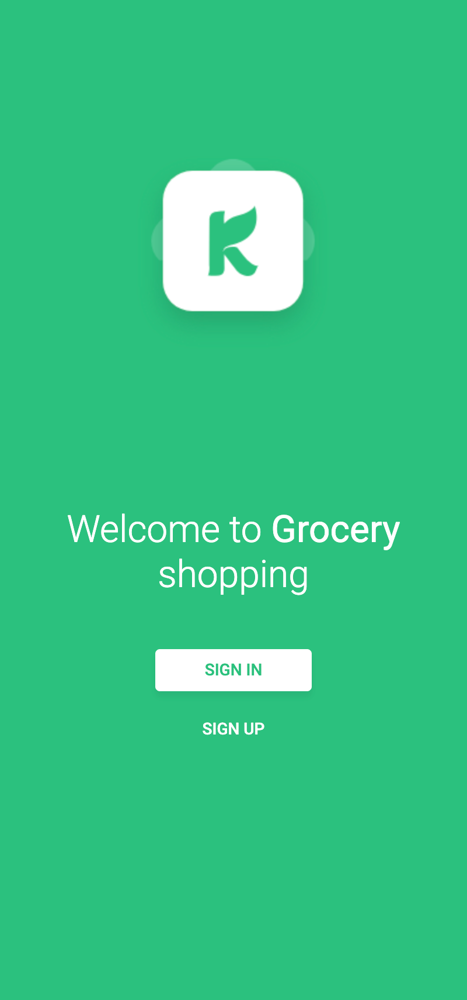
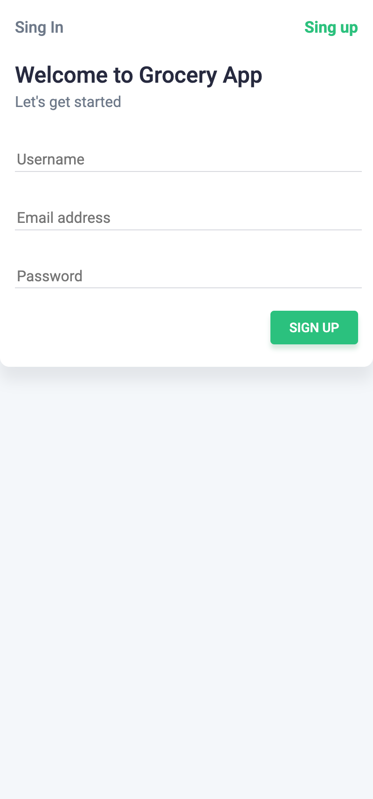

# Grocery Shopping Cart (Mobile)

<!-- PROJECT BADGES -->

  

## Project Overview

A mobile‑first React application that demonstrates a grocery shopping cart flow with authentication screens (welcome, login, sign up), reusable UI components, and responsive styling. Built with Create React App, React Router, Material‑UI, and Sass to showcase a clean, component‑driven UI for common e‑commerce interactions on smaller screens.

## Prerequisites

Make sure you have the following installed on your system:

- **Node.js**: `18.17.0` or higher
- **npm**: `9.0.0` or higher (or **yarn**: `1.22.0+`)

---

**Built with ❤️ by [Maksym Galchenko](https://github.com/maxgalchenko)**

